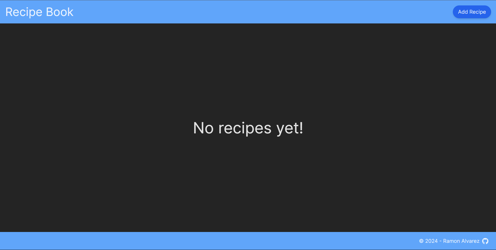

# Recipe Book Demo

This project is a simple recipe book website developed as part of a take-home assignment for the junior software engineer position at Roulettech Inc. The website is built using React.js (with Vite) for the frontend and Django for the backend. It showcases the ability to create, read, and display recipes through a user-friendly interface. The website is deployed on AWS.

# Table of Contents

- [Features](#features)
- [Tech Stack](#tech-stack)
- [Architecture](#tech-stack)
- [Setup Instructions](#setup-instructions)
- [Deployment to AWS](#deployment-to-aws)
- [Presentation](#presentation)

# Features

- Home Page: Displays a list of recipes.
- Recipe Detail Page: Shows detailed information about a single recipe.
- Add Recipe Page: Allows users to add new recipes.

# Tech Stack

## Frontend

- React.js
- Vite
- Axios
- React Router
- Tailwind CSS
- React Avatar
- React router dom
- React icons

## Backend

- Django
- Django REST Framework
- django-cors-headers

# Architecture

- AWS S3 (Frontend)
- AWS EC2 (Backend)
- AWS CloudFront (CDN)
- AWS VPC (Custom VPC with one public subnet)


# Setup Instructions

- An AWS account that has access to IAM, S3, and EC2

# Deployment to AWS

## S3 Bucket Configuration

- Create a General-Purpose Bucket
- Enable Block Public Access to ACLs, allowing policies.
- Adjust the bucket's static website hosting property to enable hosting a static website with index.html as the entry point.
- Add the Following Permission to the Bucket:

```
{
    "Version": "2012-10-17",
    "Statement": [
        {
            "Sid": "PublicReadGetObject",
            "Effect": "Allow",
            "Principal": "*",
            "Action": "s3:GetObject",
            "Resource": "arn:aws:s3:::your-bucket-name/*"
        }
    ]
}
```

### Disclaimer:

The deployment will be over HTTP and will not be secured. It will use Django's runserver, which is not recommended for production as this is just a demo application.
While HTTPS access is possible, the server will not work and will be blocked because it runs over HTTP.

## CloudFront Configuration

- Create a CloudFront Distribution:
- Choose the S3 bucket as the origin domain and click on "Use website endpoint."
- Allow HTTP methods: GET, HEAD, OPTIONS, PUT, POST, PATCH, DELETE.
- Do not enable security protections.
- Add the CNAME to your website (e.g., example.com or subdomain.example.com).

### (Optional) Configure CloudFront to domain

- Obtain a domain name to acquire an SSL certificate.
- Create an SSL certificate using AWS Certificate Manager for HTTPS and create records on your Route 53.
- Select the SSL certificate during CloudFront distribution creation.
- Create an alias record in your Route 53 hosted zone for the CloudFront distribution.

## EC2 Configuration

### IAM Policy

- Create an EC2 IAM Role for S3 Access:
- Attach the AmazonS3FullAccess policy.

### Custom VPC

- Create a custom VPC with one public subnet.

### Creating the EC2 Instance

- Create an Amazon Linux EC2 Instance with the custom VPC
- Allow auto-assign public IP.
- Configure with EC2 Instance Connect (a key pair is not needed, but you can add one for SSH if desired).
- Create a security group to allow SSH and a custom TCP port (e.g., 8000) with CIDR 0.0.0.0/0.
- Launch the instance and attach the IAM role for S3 policy.

### Coonecting to the EC2 Instance

- Use a SSH or EC2 Instance Connect.

#### Update the instance:

```
sudo yum update
```

Install necessary packages:

```
sudo yum install git -y
sudo yum install nodejs npm -y
sudo yum install python3-pip -y
```

### Setting the EC2 Instace

Clone the Repository:

```
git clone https://github.com/HeftyTie/RecipeBook.git
```

Navigate to the client folder:

```
cd RecipeBook/client
```

Edit the .env file to include the EC2 instance's public IP with HTTP and the chosen port:

```
nano .env
example: VITE_API_BASE_URL=http://ec2-publicIP:8000
```

Save and exit:

CTRL + O and Enter to save.
CTRL + X to exit.

Install dependencies and build the project:

```
npm install
npm run build
```

Upload the build to S3:

```
cd dist
aws s3 cp . s3://your-bucket-name/ --recursive
```

### Cleaning up

We no longer need the client folder, we can delete all of its content:

```
rm -r client
```

### Backend Configuration

Navigate to the server folder and install dependencies:

```
cd server
pip install -r requirements.txt
```

If errors occur, use:

```
pip install Django django-cors-headers djangorestframework
```

Start a screen session:

```
screen -S screenname
```

Run the Django server (Warning: This setup is for demo purposes only and has security vulnerabilities):

```
python3 manage.py runserver 0.0.0.0:8000
```

Detach from the screen session:

CTRL + A, then D.

#### The app is now running.

# Presentation

#### Main Image Display



#### Adding a Recipe Interface


#### Adding a Recipe Interface Filled Out


#### Home Page with Recipe Display


#### /recipes Page


#### /recipe/:id


#### Prompt Asking to Delete


#### Edit Redirects to Manage-Recipe Page


